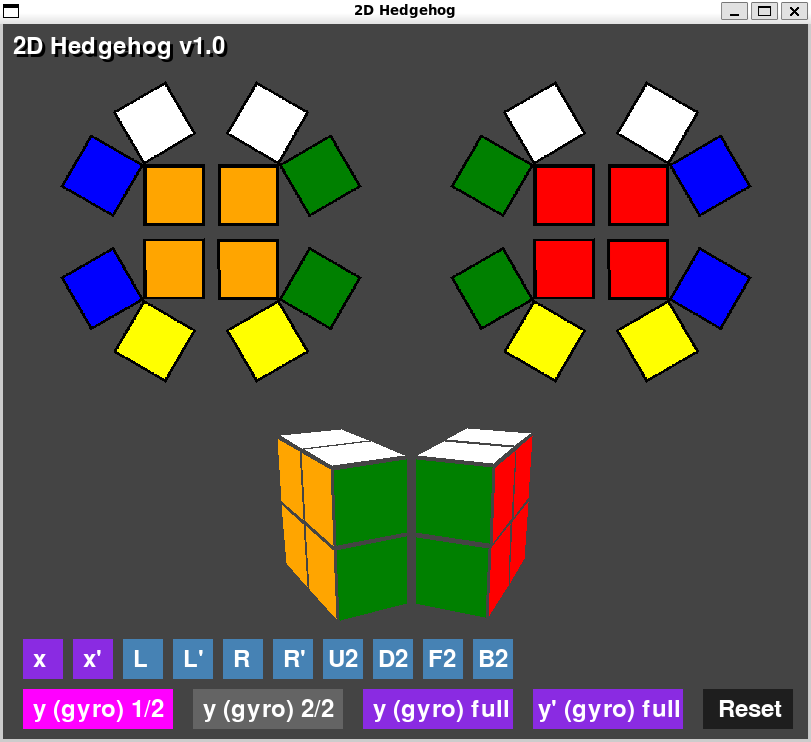

# 2D Hedgehog - A 3-dimensional 2x2x2 Rubik's Cube on the Flat Plane

This application was inspired by Burkard Polster's video, "How to build and solve a 4D Rubik's cube in physical 3D (no simulator!)" [https://www.youtube.com/watch?v=d-Yy-ILjM3k](https://www.youtube.com/watch?v=d-Yy-ILjM3k). In that video, he shows a physical puzzle, the Hedgehog, which is an "unfolded", 3-dimensional version of a hypothetical 4-dimensional 2x2x2x2 Rubik's Cube. He did this for educational purposes; the first physical 2x2x2x2 cube (in a much more playable form) was constructed by Melinda Green in 2017.

This application, which I call 2D Hedgehog, is a graphical application that simulates a 3-dimensional 2x2x2 Rubik's Cube "unfolded" into 2D, following the same principle. You can click on the various buttons and see how the Hedgehog turns and rotates. To make it easier, a half-unfolded 3D model shows the same state. The 3D model is not animated to keep the code simple.

### How to play with the 2D Hedgehog

If you want to play with it in the browser, visit [https://renslay.itch.io/2d-hedgehog](https://renslay.itch.io/2d-hedgehog).

If you want to use the desktop version, you need to be able to run Python code (preferably 3.12 or later), with the `pygame` package installed. Download the code, and run `main.py`.

I left the code that generates the images of the tiles here; see `_create_tile_images.py`. If you can code in Python and wish to alter the tiles, use that script. Otherwise, it is not related to the rest of the application.

### Hedgehog controls

Just as not every 4D turn and cube rotation is feasible on the Hedgehog, similarly not every 3D turn and cube rotation is implemented on the 2D Hedgehog. I restricted the movements to the "easy" movements: rotation along the `x` axis, turns on the left and right sides, 180° turns, and the gyro.

The gyro is a special move that reorients the entire cube along an axis that is different than `x` (`y` with the usual 3D notation), similar to how the gyro on the physical 4-dimensional cube reorients the hypercube with the 4th axis involved. It is easy to see that even with the restricted moves, every scrambled state is possible to reach.

There are multiple variants of gyro moves implemented in this application: `gyro (y) 1/2` is the first half of a full gyro move, doing the tile-sliding movement. `gyro (y) 2/2` is the second half, doing the tile-adjustment movement. These two can only be used in tandem. The other two buttons are the complete gyro movement in one animation, in two different directions.

### Implementation details

The application is written in Python 3.12.10, with `pygame` version 2.6.1 for the main application, and `pillow` version 12.0.0 for the tile image generation. The web application was done with Python WebAssembly `pygbag` version 0.9.2.

The list of files and folders:

- `main.py` is the main function and entry point for the application.
- `constants.py` is a collection of various constants and magic numbers to make the code more readable, and easier to change and adjust during development. It contains colors, pixel coordinates, rotation definitions, and similar numeric values.
- `button.py`, `model3d.py`, `tile.py` are implementations of classes used by the main code.
- `hedgehog2d.py` is the backbone of the application: it puts together the GUI and handles the main logic of the interactions.
- `_create_tile_images.py` is a helper script to create the images of the tiles in the `tile_images` folder. It is not required for the main application, as the tile images are already generated.
- `tile_images` is the folder containing the tile images.
- `build` is the folder that was created by `pygbag` for the web application.

The animation is done in a way that shows a smooth transition and rotation of the tile elements. An implementation choice was that it is possible to start a new animation while the previous one is still ongoing. This can result in fun chaos if one clicks on many buttons too quickly, and the tiles "suddenly hurry to their places" (the end result should always be correct, by the way). This can be prevented easily (for example, by deactivating all the buttons while an animation is ongoing), but I chose not to. It looks more fun this way!

### Links and references

- Burkard Polster: "How to build and solve a 4D Rubik's cube in physical 3D (no simulator!)" [https://www.youtube.com/watch?v=d-Yy-ILjM3k](https://www.youtube.com/watch?v=d-Yy-ILjM3k)

- Melinda Green's physical 2x2x2x2 Rubik's Cube [https://superliminal.com/cube/2x2x2x2/](https://superliminal.com/cube/2x2x2x2/)

- Burkard Polster's Hedgehog simulator (no animation) [https://www.qedcat.com/2x2x2x2%20hedgehog/](https://www.qedcat.com/2x2x2x2%20hedgehog/)

- Ed Collen's Hedgehog simulator [https://2x2x2x2.vercel.app/cube](https://2x2x2x2.vercel.app/cube)

- Mitchell Manning's Hedgehog simulator [https://rebelkeithy.github.io/TheHedgehog/](https://rebelkeithy.github.io/TheHedgehog/)

- Dimension Reduction Ortega, a tutorial written by myself on how to solve the 4-dimensional physical 2x2x2x2 cube [https://github.com/HantosNorbert/Dimension-Reduction-Ortega](https://github.com/HantosNorbert/Dimension-Reduction-Ortega)

- Hypercubing: the hobby of solving twisty puzzles in higher dimensions [https://hypercubing.xyz/](https://hypercubing.xyz/)

- `pygbag`, the Python Web Assembly [https://github.com/pygame-web/pygbag](https://github.com/pygame-web/pygbag)

Norbert Hantos, 2025.11.24.
